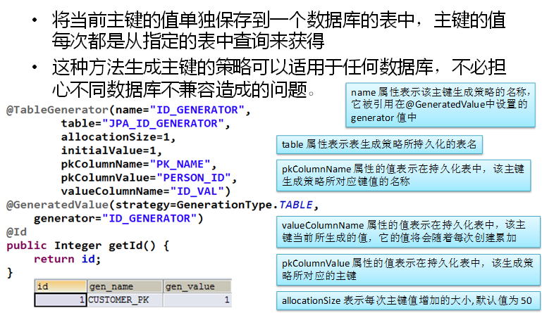
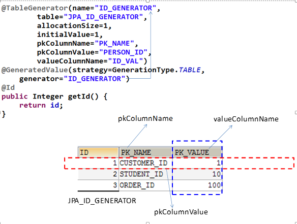
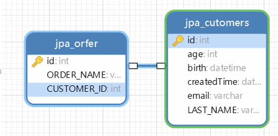
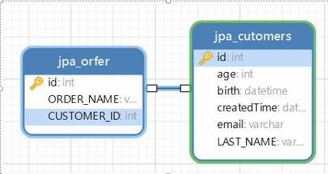

# JPAObjectMapping
实体-数据库自动生成


## 基本注解
1.  \@Entity

    -   \@Entity 标注用于实体类声明语句之前，**指出该Java
        类为实体类**，**将映射到指定的数据库表**。如声明一个实体类
        Customer，它将映射到数据库中的 customer 表上。

2.  \@Table

    -   **当实体类与其映射的数据库表名不同名时**需要使用 **\@Table**
        标注说明，该标注**与 \@Entity
        标注并列使用**，置于实体类声明语句之前，可写于单独语句行，也可与声明语句同行。

    -   \@Table 标注的常用选项是 **name**，用于指明数据库的表名

>   \@Table标注还有一个两个选项 catalog 和 schema
>   用于设置表所属的数据库目录或模式，通常为数据库名。uniqueConstraints
>   选项用于设置约束条件

```
@Entity
@Table(name="JPA_CUTOMERS")
public class Customer {
```


3.  \@Id

    -   \@Id
        标注用于声明一个实体类的属性映射为数据库的**主键列**。该属性通常置于属性声明语句之前，可与声明语句同行，也可写在单独行上。

    -   \@Id标注也可置于属性的**getter方法之前**。

```
@GeneratedValue(strategy=GenerationType.AUTO)
@Id
private Integer id;
```


4.  \@GeneratedValue

    -   **\@GeneratedValue 用于标注主键的生成策略**，**通过 strategy
        属性指定**。**默认情况下，JPA
        自动选择一个最适合底层数据库的主键生成策略**：SqlServer 对应
        identity，MySQL 对应 auto increment。

    -   在 javax.persistence.GenerationType 中定义了以下几种可供选择的策略：

        -   **IDENTITY**：采用数据库 ID自增长的方式来自增主键字段，Oracle
            不支持这种方式；

        -   **AUTO： JPA自动选择合适的策略，是默认选项**；

        -   **SEQUENCE**：通过序列产生主键，通过 **\@SequenceGenerator**
            注解指定序列名，MySql 不支持这种方式

        -   **TABLE**：通过表产生主键，框架借由表模拟序列产生主键，使用该策略可以使应用更易于数据库移植。

5.  \@Basic

    -   \@Basic 表示一个简单的属性到数据库表的字段的映射,对于**没有任何标注的
        getXxxx() 方法,默认即为\@Basic**

    -   fetch: 表示该属性的读取策略,有 EAGER 和 LAZY
        两种,分别表示主支抓取和延迟加载,默认为 EAGER.

    -   optional:表示该属性是否允许为null, 默认为true

6.  \@Column

    -   **当实体的属性与其映射的数据库表的列不同名时需要使用\@Column
        标注说明**，该属性通常置于实体的属性声明语句之前，还可与 \@Id
        标注一起使用。

    -   \@Column 标注的常用属性是
        name，用于设置映射数据库表的列名。此外，该标注还包含其它多个属性，如：**unique**
        、**nullable**、**length** 等。

    -   \@Column 标注的 columnDefinition 属性:
        **表示该字段在数据库中的实际类型**.通常 ORM
        框架可以根据属性类型自动判断数据库中字段的类型,但是对于Date类型仍无法确定数据库中字段类型究竟是DATE,TIME还是TIMESTAMP.此外,String的默认映射类型为VARCHAR,
        如果要将 String 类型映射到特定数据库的 BLOB 或TEXT 字段类型.

    -   \@Column标注也可置于属性的getter方法之前

7.  **\@Transient（不需要映射到数据表的注解）**

    -   **表示该属性并非一个到数据库表的字段的映射,ORM框架将忽略该属性.**

    -   **如果一个属性并非数据库表的字段映射,就务必将其标示为\@Transient,否则,ORM框架默认其注解为\@Basic**

8.  **\@Temporal**

    -   **在核心的 Java API 中并没有定义 Date 类型的精度(temporal precision).
        而在数据库中,表示 Date 类型的数据有 DATE, TIME, 和 TIMESTAMP
        三种精度(即单纯的日期,时间,或者两者 兼备).
        在进行属性映射时可使用\@Temporal注解来调整精度.**

 
## 用 table 来生成主键



> 示例代码

```
public class Customer {
	@TableGenerator(name="ID_GENERATOR",//@GeneratedValue 的 generator值
		table="JPA_ID_GENERATORS",//使用哪张表
		pkColumnName="PK_NAME",//主键字段
		pkColumnValue="CUSTOMR_ID",//主键字段值
		valueColumnName="PK_VALUE",//ID值字段
		allocationSize=1)//自动增长步数
	@GeneratedValue(strategy=GenerationType.TABLE,generator="ID_GENERATOR")
	@Id
	private Integer id;

```
 

## 映射关联关系

### 单向

1. 映射**单向多对一**的关联关系

>   以下代码省略Getter Setter方法

>   Customer .java

```
@Entity
@Table(name="JPA_CUTOMERS")
public class Customer {
	@GeneratedValue(strategy=GenerationType.AUTO)
	@Id
	private Integer id;
	
	@Column(name="LAST_NAME",length=50,nullable=false)
	private String lastName;

	private String email;
	private int age;
	
	@Temporal(TemporalType.TIMESTAMP)
	private Date createdTime;
	private Date birth;
}
```

>   Order.java
 ```
@Entity
@Table(name="JPA_Orfer")
public class Order {
	
	@GeneratedValue
	@Id
	private Integer id;
	@Column(name="ORDER_NAME")
	private String orderName;
	
	//映射单向 n-1 的关联关系
	//使用 @ManyToOne 来映射多对一的关联关系
	//使用 @JoinColumn 来映射外键. 
	//可使用 @ManyToOne 的 fetch 属性来修改默认的关联属性的加载策略
	@JoinColumn(name="CUSTOMER_ID")
	@ManyToOne
	private Customer customer;
}
 ```

>   数据库关系


 
2. 映射**单向一对多**的关联关系

>   以下代码省略Getter Setter方法

>   Customer .java
```
@Entity
@Table(name="JPA_CUTOMERS")
public class Customer {
	@GeneratedValue(strategy=GenerationType.AUTO)
	@Id
	private Integer id;
	
	@Column(name="LAST_NAME",length=50,nullable=false)
	private String lastName;

	private String email;
	private int age;
	
	@Temporal(TemporalType.TIMESTAMP)
	private Date createdTime;
	private Date birth;
	
	//映射单向 1-n 的关联关系
	//使用 @OneToMany 来映射 1-n 的关联关系
	//使用 @JoinColumn 来映射外键列的名称
	//可以使用 @OneToMany 的 fetch 属性来修改默认的加载策略（测试代码1）
	 //可以通过 @OneToMany 的 cascade 属性来修改默认的删除策略. （测试代码2）
	 //注意: 若在 1 的一端的 @OneToMany 中使用 mappedBy 属性, 则 @OneToMany 端就不能再使用 @JoinColumn 属性了. 
	@JoinColumn(name="CUSTOMER_ID")
	@OneToMany
	private Set<Order> orders = new HashSet<>();
}
```

>   Order.java

```
@Entity
@Table(name="JPA_Orfer")
public class Order {
	
	@GeneratedValue
	@Id
	private Integer id;
	@Column(name="ORDER_NAME")
	private String orderName;
}
```


>   数据库关系


